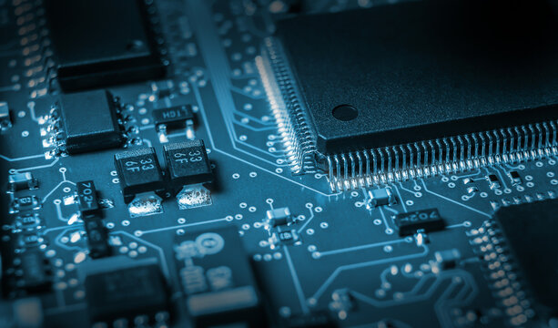

 <!-- Replace with your banner image filename -->

# 👋 ASAD ULLAH: EMBEDDED FIRMWARE ENGINEER

> *"Never Give Up"* 😎
---

---

Welcome to my GitHub profile! I specialize in embedded systems and firmware development, combining hardware and software to create intelligent, connected solutions. Whether it's IoT devices, wireless communication, or real-time embedded applications — this is where innovation happens.

## 🔧 About Me

- 🎯 **Embedded Systems Developer**  
   Experienced with microcontrollers like **ESP32**, **STM32**, and **AVR**, focused on writing efficient low-level firmware for real-time systems.

- 📡 **IoT Integrator**  
   Skilled in wireless communication technologies such as **BLE**, **ESP-NOW**, **Zigbee**, and **MQTT**, enabling smart device connectivity.

- 🌐 **Cloud-Connected Solutions**  
   Proficient in integrating cloud platforms like **AWS IoT** and **Google Cloud** for remote monitoring and control.

- 🛠 **Problem Solver**  
   Passionate about debugging, optimizing performance, and pushing hardware to its limits.

---

## 💻 Skills & Technologies

- **Languages**: C, C++, Python, JavaScript, QML  
- **Microcontrollers**: ESP32, STM32, NRF52, PIC, 8051, Raspberry Pi  
- **Communication Protocols**: BLE, ESP-NOW, Zigbee, LoRa, MQTT  
- **Tools & IDEs**: PlatformIO, VS Code, STM32CubeIDE, Arduino, Keil, MPLAB, NRF Connect  
- **Cloud Platforms**: AWS IoT, Google Cloud  
- **Databases**: PostgreSQL, Firebase  

---

## 🔗 Let’s Connect

- 📧 **Email**: asadali56656@gmail.com  
