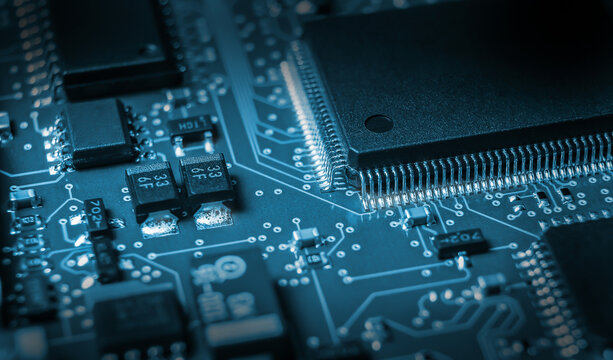

# 👋 ASAD ULLAH: EMBEDDED FIRMWARE ENGINEER

> *"Never Give Up"* 😎
---

  

---

Welcome to my GitHub profile! I specialize in embedded systems and firmware development, combining hardware and software to create intelligent, connected solutions. Whether it's IoT devices, wireless communication, or real-time embedded applications — this is where innovation happens.

## 🔧 About Me

- 🎯 **Embedded Systems Developer**  
   Experienced with microcontrollers like **ESP32**, **STM32**, and **AVR**, focused on writing efficient low-level firmware for real-time systems.

- 📡 **IoT Integrator**  
   Skilled in wireless communication technologies such as **BLE**, **ESP-NOW**, **Zigbee**, and **MQTT**, enabling smart device connectivity.

- 🌐 **Cloud-Connected Solutions**  
   Proficient in integrating cloud platforms like **AWS IoT** and **Google Cloud** for remote monitoring and control.

- 🛠 **Problem Solver**  
   Passionate about debugging, optimizing performance, and pushing hardware to its limits.

---

## 💻 Skills & Technologies

### 🖥️ Languages

  
  
  
  

### 🔌 Microcontroller / Compute Modules

  
  
  
  
  
  

### 📡 Protocols — Wireless

  
  
  
  
  
  
  

### 🛠️ IDEs / Code Editors / Frameworks

  
  
  
  
  
  
  
  

### ☁️ Clouds

  
  
  

### 🧰 Tools

  
  
  
  

---

# 📁 Projects

## 🔌 Zigbee-Based Wireless Monitoring System (ESP32-C6)

In this project, I developed a wireless data communication system using **Zigbee protocol** between a **Coordinator (Server)** and a **Router (Client)**.

### 📡 Project Overview:

- **Router (Client)**:
  - Acts as a **Zigbee Router** using `ESP32-C6` with the **ESP-IDF framework**.
  - Collects real-time current readings using a **Current Transformer (CT Sensor)**.
  - Sends the sensor data wirelessly to the Coordinator.

- **Coordinator (Server)**:
  - Also based on `ESP32-C6` configured as a **Zigbee Coordinator**.
  - Receives the current readings from the router node.
  - Can be expanded to log data, visualize trends, or trigger actions.

### ⚙️ Technologies Used:
- **ESP32-C6** (with Zigbee support)
- **ESP-IDF** (Espressif IoT Development Framework)
- **Zigbee Protocol**
- **Current Transformer (CT) Sensor**
- **UART & Wireless Communication**

> 📌 *This project demonstrates wireless sensor communication using Zigbee for applications like smart metering, energy monitoring, and home automation.*

[//]: # (Code not shared publicly for confidentiality. You can contact me to discuss the implementation.)

---
# BLE and ESP-NOW Based Wireless Audio Communication

This project showcases a **real-time wireless audio communication system** using **ESP32-S3 microcontrollers**, leveraging **custom BLE services** and the **ESP-NOW protocol**.

## 🧠 Project Overview

A custom **Bluetooth Low Energy (BLE)** service was developed on the ESP32-S3 and interfaced with the **nRF Connect mobile application**. Using this app, specific commands were sent to the ESP32. The key command, **"Start Communication"**, triggered wireless audio streaming functionality.

Once activated:

- The **server-side ESP32-S3**, connected to a **microphone**, captured audio samples.
- Audio data was packed into buffers and transmitted wirelessly using **ESP-NOW** to the **client-side ESP32-S3**.
- The **client ESP32** decoded the received audio buffers and played them in real-time using an **audio amplifier**.

This approach repurposes **ESP-NOW**, typically used for control signals, to handle **real-time audio streaming**, which is both bandwidth-intensive and time-sensitive.

## 🚀 Features

- ✅ **Custom BLE service** with command-based control
- 📶 **Real-time wireless audio streaming** using ESP-NOW
- 🎙️ **Microphone-based audio capture**
- 🔊 **Audio playback through amplifier**
- ⚙️ Developed using **ESP-IDF** for bare-metal firmware control

## 🔧 Technologies Used

- **ESP32-S3**
- **ESP-IDF**
- **nRF Connect (mobile BLE app)**
- **BLE (Bluetooth Low Energy)**
- **ESP-NOW protocol**

## 📂 Repository Structure

> _Note: Code is not included here. This repository serves as a project showcase._
